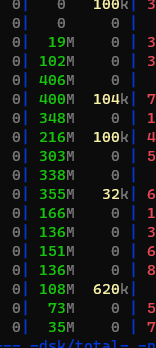
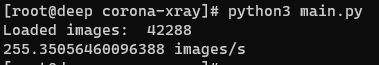

# Multi CPU image processing
I want to write high performance image loader. For now I'm stack at 250 images/s

# DataSet images download
Data set can be downloaded by
`kaggle datasets download -d praveengovi/coronahack-chest-xraydataset`  

# Run
Tu run you can use image_processing notebook or `main.py`

# Current stats

## Disk usage

## Images per second stats

# Questions
I defenitely don't know how to go further. Is there a way to read images streight to GPU? Use of another library to read image? Another way of multiprocessing files?
